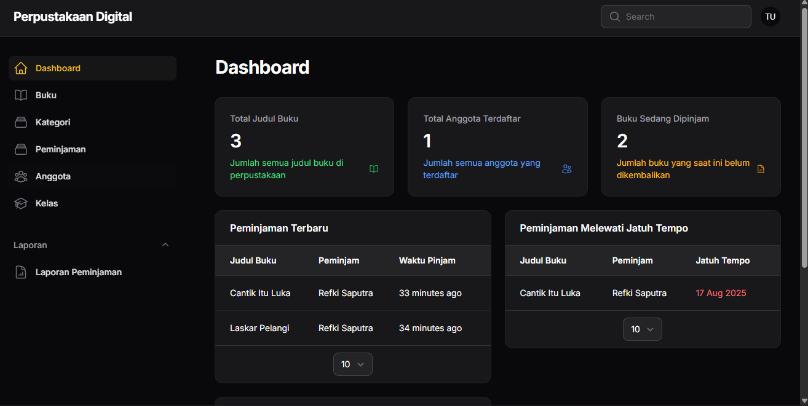
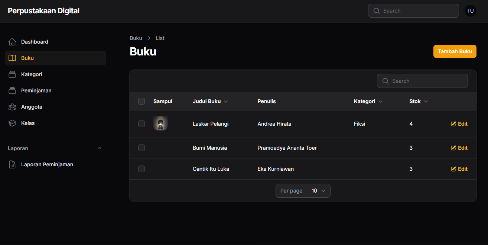
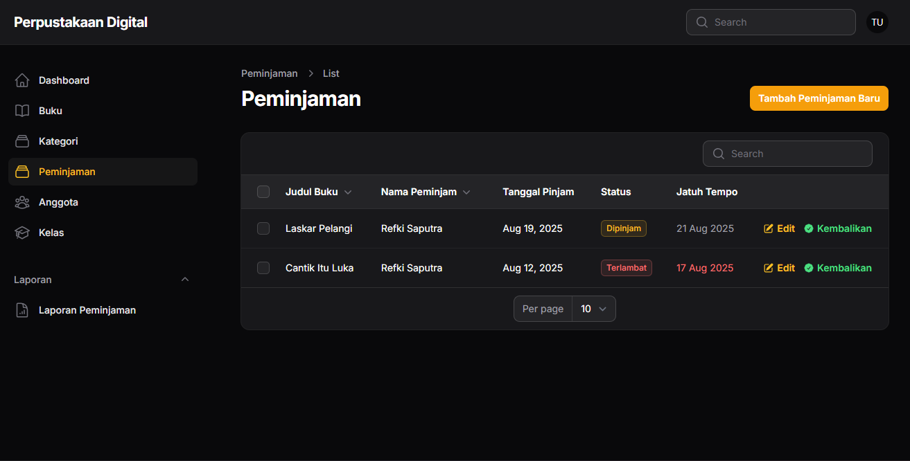

# 📚 Aplikasi Perpustakaan

Selamat datang di **Perpustakaan App**!
Aplikasi berbasis **Laravel** untuk mengelola data buku, anggota, serta transaksi peminjaman & pengembalian.
Didesain untuk **sekolah, kampus, maupun komunitas** yang ingin sistem perpustakaannya rapi tanpa ribet.

---

## ✨ Fitur Utama

* 🔐 **Autentikasi** (Login & Register)
* 📖 **Manajemen Buku**: tambah, edit, hapus, pencarian
* 👥 **Manajemen Anggota**: daftar anggota & detail
* 🔄 **Transaksi**: peminjaman & pengembalian
* 📊 **Laporan**: status buku & riwayat pinjam
* 🎨 **UI Sederhana & Responsif** (Blade/Laravel Breeze)
* 🧪 **Testing**: PHPUnit untuk memastikan fitur stabil

> ⚠️ *Catatan:* Saat ini masih tahap awal. Jadi jangan heran kalau kadang ada bug numpang lewat. 😅

---

## 🚀 Instalasi & Setup

1. **Clone repository**

   ```bash
   git clone https://github.com/kyraara/perpustakaan.git
   cd perpustakaan
   ```

2. **Install dependencies**

   ```bash
   composer install
   ```

3. **Copy file environment**

   ```bash
   cp .env.example .env
   ```

4. **Generate key**

   ```bash
   php artisan key:generate
   ```

5. **Setup database**

   * Edit `.env` sesuai konfigurasi database lokal (`DB_DATABASE`, `DB_USERNAME`, `DB_PASSWORD`).
   * Jalankan migrasi & seeder:

     ```bash
     php artisan migrate --seed
     ```

6. **Jalankan aplikasi**

   ```bash
   php artisan serve
   ```

   Akses via browser 👉 [http://localhost:8000](http://localhost:8000)

---

## 📂 Struktur Proyek

```
perpustakaan/
├── app/            # Logic utama aplikasi
├── routes/         # File routing web & API
├── database/       # Migration, Seeder, Factory
├── resources/      # Blade views, CSS, JS
├── tests/          # Unit & Feature testing
└── ...
```

---

## 🖼️ Demo (Mockup)

### 📊 Dashboard



### 📖 Manajemen Buku



### 🔄 Peminjaman Buku



> Gambar di atas masih **mockup placeholder**. Nanti bisa diganti dengan screenshot asli aplikasi.

---

## 💡 Catatan Penutup

Aplikasi ini masih **versi awal**, tapi tujuannya jelas:
Bikin sistem perpustakaan yang **simple, powerful, dan bisa dipakai di mana aja**.

Kalau menurut lo bermanfaat, kasih ⭐ di repo ini.
Biar repo ini nggak jadi kayak buku ensiklopedia—ada tapi jarang dibaca. 😎📖✨
